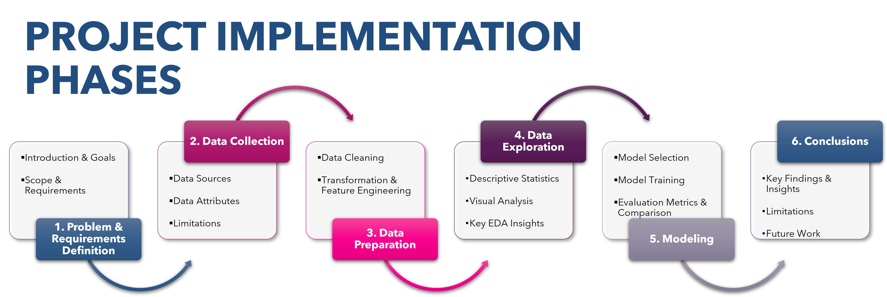

# Developer Salary Prediction

### Author: Topaz F. Montague  
Northwest Missouri State University, Maryville MO 64468, USA  
Email: [S572397@nwmissouri.edu](mailto:S572397@nwmissouri.edu), [tmontaguegc@gmail.com](mailto:tmontaguegc@gmail.com)

## Abstract

This project focuses on using machine learning to predict developer salaries based on demographic and job-related factors. By leveraging salary surveys and machine learning techniques, the project aims to uncover the main contributors to salary differences and offer insights that can help address pay disparities in the tech industry.

**Keywords**: machine learning, salary prediction, developer compensation, feature engineering, predictive modeling.

## Introduction

The technology industry plays a major role in shaping today’s world, and with it comes discussions around pay equity and diversity. As developers are key drivers of innovation, understanding what influences their salaries is essential. A recent survey highlighted pay gaps related to factors like gender, education, and experience, which can lead to significant differences in compensation. Through predictive analytics, we can delve into this data to understand how these factors influence developer salaries. The insights can help companies design fairer pay structures and provide developers with clarity around compensation drivers.

## Goals of This Project

This project analyzes developer salaries using machine learning, aiming to provide a deeper understanding of the factors that contribute to salary disparities.

- **Primary Goal**: Develop a machine learning model that accurately predicts salaries based on demographic and professional data.
- **Secondary Goal**: Identify the most influential factors affecting salary disparities, such as education, gender, and experience.
- **Expected Outcome**: Create a reliable model that employers and developers can use to better understand salary benchmarks.

## Scope and Requirements

This project involves developing a machine learning model to predict developer salaries using tools such as Python for data analysis, VS Code for development, GitHub for version control, and Jupyter Notebooks for exploration, training, and evaluation. A Shiny app provides a dynamic dashboard where users can input data and receive salary predictions, while Overleaf with LaTeX is used for the project report.

### Project Links

- [Developer Salary GitHub Repository](https://github.com/tfmontague/developer-salary-capstone)
- [Developer Salary Overleaf Project Report](https://www.overleaf.com/read/kvnwjkgcfwkp#49128f)
- [Developer Salary Shiny App Dashboard](https://shiny.posit.co/py/)

## Project Implementation Process

The project follows a standard data analytics approach with these phases:

1. **Problem and Requirements Definition**
    - Introduction and Goals
    - Scope and Requirements
2. **Data Collection**
    - Data Sources
    - Data Attributes
    - Limitations
3. **Data Preparation**
    - Data Cleaning
    - Transformation and Feature Engineering
4. **Data Exploration**
    - Descriptive Statistics
    - Visual Analysis
    - Key Insights from EDA
5. **Modeling**
    - Model Selection
    - Model Training
    - Evaluation Metrics
    - Model Comparison
6. **Conclusion**
    - Key Findings
    - Insights
    - Limitations
    - Future Work

## Data Collection

This project uses data from the 2024 Stack Overflow Developer Survey and the Bureau of Labor Statistics (BLS). Stack Overflow provides valuable real-world insights into developer roles, skills, and pay, while the BLS offers reliable, comprehensive salary data. Together, these sources offer a solid foundation for analyzing developer salaries.

### Data Sources
- [2024 Stack Overflow Annual Developer Survey](https://survey.stackoverflow.co/)
- [May 2023 State Data - Occupational Employment and Wage Statistics](https://www.bls.gov/oes/tables.htm)

### Data Attributes

#### 2024 Stack Overflow Annual Developer Survey Data Attributes

| **Attribute**      | **Description**                                                    | **Example Values**                           |
|--------------------|--------------------------------------------------------------------|----------------------------------------------|
| **RespondId**       | Unique identifier for each respondent                             | 390, 399, 417                                |
| **Age Range**       | Age group of the respondent                                        | 25-34, 45-54, 18-24                          |
| **RemoteWork**      | Work arrangement of the respondent                                 | Remote, In-person, Hybrid                    |
| **EdLevel**         | Highest education level attained by the respondent                 | Bachelors, Masters, Some college             |
| **YearsCode**       | Number of years the respondent has been coding or programming      | 7, 38, 21                                    |
| **DevType**         | Type of developer or role the respondent identifies with           | Full-stack developer, Back-end developer     |
| **OrgSize**         | Size of the organization the respondent works for                  | 1,000 to 4,999, 10 to 19                     |
| **Country**         | Country of residence or work of the respondent                     | United States of America, Brazil, Ukraine    |
| **ICorPM**          | Role designation: individual contributor or people manager         | Individual contributor, People manager       |
| **WorkExp**         | Number of years the respondent has been working professionally     | 8, 30, 17                                    |
| **Industry**        | Industry in which the respondent is employed                       | Software Development, Healthcare, Government |
| **TotalComp**       | Total yearly compensation, including salary, bonuses, etc. (USD)   | \$110,000, \$195,000, \$170,000              |
| **Language_Various**| Whether the respondent has experience with various programming languages | Yes, No                                  |
| **Database_Various**| Whether the respondent has experience with various databases       | Yes, No                                      |

---

#### May 2023 BLS Occupational Employment and Wage Statistics Data Attributes

| **Attribute**      | **Description**                                                    | **Example Values**                           |
|--------------------|--------------------------------------------------------------------|----------------------------------------------|
| **State**           | The U.S. state where the job or occupation is located              | Alabama, Alaska, Arizona                     |
| **Title**           | The job title or role associated with the given statistics         | Software Developers, Web Developers, etc.    |
| **Size**            | Number of individuals employed in the specified occupation within the state | 1860, 17130, 304390                  |
| **AvgSalary**       | Average (mean) salary for the given occupation in the state (USD)  | \$97,020, \$145,420, \$110,630               |

### Limitations
This project focuses exclusively on developer salary data from 2023 and 2024, limiting the analysis to those two years. It does not include historical salary trends from earlier years, nor does it cover other tech-related roles outside of developer positions. These limitations may affect the broader applicability of the results.

## Data Preparation

### Data Cleaning
Placeholder text.

### Transformation and Feature Engineering
Placeholder text.

## Data Exploration

### Descriptive Statistics
Placeholder text.

### Visual Analysis
Placeholder text.

### Key Insights from EDA
Placeholder text.

## Modeling

### Model Selection
Placeholder text.

### Model Training
Placeholder text.

### Model Comparison
Placeholder text.

## Conclusion

### Key Findings
Placeholder text.

### Insights
Placeholder text.

### Limitations
Placeholder text.

### Future Work
Placeholder text.

## References

- Stack Overflow Developer Survey 2024: [https://survey.stackoverflow.co/](https://survey.stackoverflow.co/)
- Bureau of Labor Statistics: [https://www.bls.gov/oes/tables.htm](https://www.bls.gov/oes/tables.htm)
