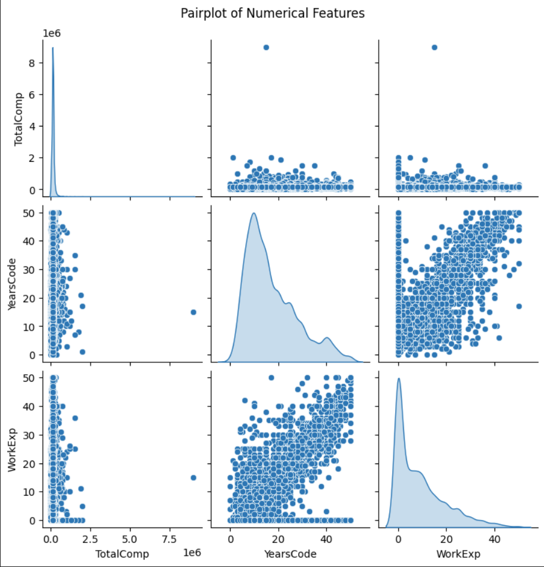
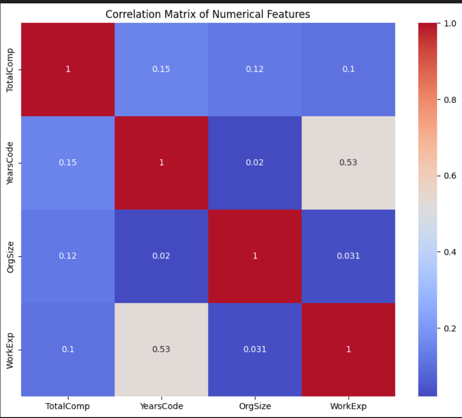

# Developer Salary Prediction

### Author: Topaz F. Montague  
Northwest Missouri State University, Maryville MO 64468, USA  
Email: [S572397@nwmissouri.edu](mailto:S572397@nwmissouri.edu), [tmontaguegc@gmail.com](mailto:tmontaguegc@gmail.com)

## Abstract

This project focuses on using machine learning to predict developer salaries based on demographic and job-related factors. By leveraging salary surveys and machine learning techniques, the project aims to uncover the main contributors to salary differences and offer insights that can help address pay disparities in the tech industry.

**Keywords**: machine learning, salary prediction, developer compensation, feature engineering, predictive modeling.

## Introduction

The technology industry plays a major role in shaping today’s world, and with it comes discussions around pay equity and diversity. As developers are key drivers of innovation, understanding what influences their salaries is essential. A recent survey highlighted pay gaps related to factors like gender, education, and experience, which can lead to significant differences in compensation. Through predictive analytics, we can delve into this data to understand how these factors influence developer salaries. The insights can help companies design fairer pay structures and provide developers with clarity around compensation drivers.

## Goals of This Project

This project analyzes developer salaries using machine learning, aiming to provide a deeper understanding of the factors that contribute to salary disparities.

- **Primary Goal**: Develop a machine learning model that accurately predicts salaries based on demographic and professional data.
- **Secondary Goal**: Identify the most influential factors affecting salary disparities, such as education, gender, and experience.
- **Expected Outcome**: Create a reliable model that employers and developers can use to better understand salary benchmarks.

## Scope and Requirements

This project involves developing a machine learning model to predict developer salaries using tools such as Python for data analysis, VS Code for development, GitHub for version control, and Jupyter Notebooks for exploration, training, and evaluation. A Shiny app provides a dynamic dashboard where users can input data and receive salary predictions, while Overleaf with LaTeX is used for the project report.

### Project Links

- [Developer Salary GitHub Repository](https://github.com/tfmontague/developer-salary-capstone)
- [Developer Salary Overleaf Project Report](https://www.overleaf.com/read/kvnwjkgcfwkp#49128f)
- [Developer Salary Shiny App Dashboard](https://shiny.posit.co/py/)

## Project Implementation Process

The project follows a standard data analytics approach with these phases:

1. **Problem and Requirements Definition**
    - Introduction and Goals
    - Scope and Requirements
2. **Data Collection**
    - Data Sources
    - Data Attributes
    - Limitations
3. **Data Preparation**
    - Data Cleaning
    - Transformation and Feature Engineering
4. **Data Exploration**
    - Descriptive Statistics
    - Visual Analysis
    - Key Insights from EDA
5. **Modeling**
    - Model Selection
    - Model Training
    - Evaluation Metrics
    - Model Comparison
6. **Conclusion**
    - Key Findings
    - Insights
    - Limitations
    - Future Work

## Data Collection

This project uses data from the 2024 Stack Overflow Developer Survey and the Bureau of Labor Statistics (BLS). Stack Overflow provides valuable real-world insights into developer roles, skills, and pay, while the BLS offers reliable, comprehensive salary data. Together, these sources offer a solid foundation for analyzing developer salaries.

### Data Sources
- [2024 Stack Overflow Annual Developer Survey](https://survey.stackoverflow.co/)
- [May 2023 State Data - Occupational Employment and Wage Statistics](https://www.bls.gov/oes/tables.htm)

### Data Attributes

#### 2024 Stack Overflow Annual Developer Survey Data Description & Attributes

The 2024 Stack Overflow Developer Survey dataset includes approximately 8,500 records and 97 columns that capture information on developers’ demographics, roles, work environments, and salaries. The purpose of this dataset is to understand salary trends and the factors influencing compensation across various developer roles.

Below is the data attribute dictionary that outlines the key variables within our dataset:

| Column Name         | Description                                                                                           | Data Type | Example Value    |
|---------------------|-------------------------------------------------------------------------------------------------------|-----------|------------------|
| RespondId           | Unique identifier for each respondent                                                                 | Integer   | 390              |
| Age Range           | Age group of the respondent                                                                           | Integer   | 25-34            |
| RemoteWork          | Work arrangement of the respondent (e.g., remote, in-person, hybrid)                                  | String    | Remote           |
| EdLevel             | Highest education level attained by the respondent                                                    | String    | Bachelors        |
| YearsCode           | Number of years the respondent has been coding or programming                                         | Integer   | 7                |
| DevType             | Type of developer or role the respondent identifies with                                              | String    | Full-stack       |
| OrgSize             | Size of the organization the respondent works for                                                     | Integer   | 1000             |
| Country             | Country of residence or work of the respondent                                                        | String    | United States    |
| ICorPM              | Role designation specifying if the respondent is an individual contributor or a people manager        | String    | Individual contributor |
| WorkExp             | Number of years the respondent has been working professionally                                        | Integer   | 8                |
| Industry            | Industry in which the respondent is employed                                                          | String    | Software Development |
| TotalComp           | Total yearly compensation, including salary, bonuses, etc. (formatted in USD)                         | Float     | 110000           |
| Language_Various      | Binary column indicating whether the respondent has worked with various programming languages (Yes/No) | String    | Yes              |
| Database_Various      | Binary column indicating whether the respondent has worked with various databases (Yes/No) | String    | Yes              |

---

#### May 2023 BLS Occupational Employment and Wage Statistics Data Description & Attributes

 The 2023 BLS dataset includes information about wages and employment statistics across different states and industries within the United States, with 258 records and 4 columns. The dataset is designed to provide insights into salary average salaries by state, and other relevant workforce demographics.

Below is the data attribute dictionary that outlines the key variables within our dataset:

| Column Name         | Description                                                                                       | Data Type | Example Value |
|---------------------|---------------------------------------------------------------------------------------------------|-----------|---------------|
| State               | Name of the U.S. state or territory                                                               | String    | California    |
| AvgSalary           | Average salary of employees in the state                                                          | Float     | 97583.49      |
| Size                | Number of employees in the dataset for each state or job category                                 | Integer   | 8890          |
| Occupation          | Job title or occupation category                                                                  | String    | Software Engineer |

### Limitations
This project focuses exclusively on developer salary data from 2023 and 2024, limiting the analysis to those two years. It does not include historical salary trends from earlier years, nor does it cover other tech-related roles outside of developer positions. These limitations may affect the broader applicability of the results.

## Data Preparation

#### Data Cleaning
The [2024 Stack Overflow Annual Developer Survey](https://survey.stackoverflow.co/) data was cleaned by handling missing values through removal, deleting outliers, and ensuring consistency in categorical and numerical variables. To clean the [May 2023 State Data - Occupational Employment and Wage Statistics](https://www.bls.gov/oes/tables.htm), unrelated job titles were deleted, and missing values were addressed by inputting mean values.

### Data Cleaning

The [2024 Stack Overflow Annual Developer Survey](https://survey.stackoverflow.co/) was cleaned using several targeted steps to ensure data consistency and relevance for salary prediction. First, columns that were not central to the project goals, such as `PlatformHaveWorkedWith`, `WebframeHaveWorkedWith`, `EmbeddedHaveWorkedWith`, and `ToolsTechHaveWorkedWith`, were removed to simplify the dataset and focus on key features. To maintain data integrity, records with incomplete responses were dropped, ensuring that each entry used for model training was fully populated. Only entries reporting salary in USD were retained to keep `TotalComp` consistent across observations.

Data types were then standardized, with features like `Age Range`, `OrgSize`, and `YearsCode` converted to appropriate numerical values. Categorical variables such as `Age Range`, `EdLevel`, `DevType`, `OrgSize`, and `Industry` were encoded to ensure compatibility in the analysis phase. Additionally, extreme values in `TotalComp` were managed by capping salaries at $400,000 to reduce the effect of outliers on model performance.

For the [May 2023 State Data - Occupational Employment and Wage Statistics](https://www.bls.gov/oes/tables.htm), only essential columns like `State`, `Title`, `Size`, and `AvgSalary` were retained. Non-developer job titles were removed to keep the dataset focused on relevant roles. Since this dataset contained no missing values, imputation was not required, streamlining the data preparation for this source.

### Transformation and Feature Engineering

During transformation and feature engineering for the [2024 Stack Overflow Annual Developer Survey](https://survey.stackoverflow.co/), categorical features such as `DevType` and `RemoteWork` were converted to numerical formats using one-hot encoding to allow for machine learning model compatibility. Key numerical variables, such as `YearsCode` and `WorkExp`, were scaled to ensure consistent data ranges, reducing the potential for model bias toward higher-magnitude features. New features were engineered by creating broader experience categories that combined `YearsCode` and `WorkExp`, as well as generating interaction terms between `EdLevel` and `DevType` to capture more complex relationships between education and developer roles.

For the [May 2023 State Data - Occupational Employment and Wage Statistics](https://www.bls.gov/oes/tables.htm), categorical variables like `RemoteWork` and `DevType` were transformed using one-hot encoding, and continuous variables such as `YearsCode` and `WorkExp` were normalized to maintain uniform scaling. Binary columns were added to represent experience with specific programming languages and databases, making the dataset more robust for analysis.

These cleaning, transformation, and engineering steps ensured that both datasets were well-prepared for predictive modeling, aligned in structure, and optimized to capture meaningful relationships in the data.

#### Transformed Files
- [2024 Developer Survey Data](https://github.com/tfmontague/developer-salary-capstone/blob/main/data/cleaned/Transformed_Developer_Survey_Data.csv): The Developer Survey data serves as the primary dataset for building and training the salary estimator model. This dataset includes detailed information on job titles, coding experience, work experience, and other demographic factors relevant to developer compensation. The data is used to train the machine learning model for salary prediction, and it also feeds directly into the Shiny app, allowing users to interactively estimate salaries based on selected inputs such as job title, coding experience, database experience, and years of professional experience.
- [2023 Bureau of Labor Statistics (BLS) Data](https://github.com/tfmontague/developer-salary-capstone/blob/main/data/cleaned/Transformed_bls2023_dl.csv): The BLS data provides geographic insights into average salaries by state across the United States. This dataset is integrated into the Shiny app’s dynamic dashboard to visualize state-level average salaries, offering a comprehensive geographical context to the salary estimator. By leveraging the BLS data, the dashboard enhances the model's predictions with real-world regional salary benchmarks, enabling users to compare estimated salaries with state averages across different locations.

## Data Exploration
The Data Exploration deliverable in the salary estimator project, conducted in Jupyter Notebook, provides a comprehensive initial analysis of the dataset, encompassing descriptive statistics, visual analysis, and key insights from exploratory data analysis (EDA). This deliverable includes summarizing key salary-related measures such as average compensation, distribution of salaries across job roles, experience levels, and demographic factors. Through Jupyter Notebook, we use visualizations and statistical summaries to identify patterns, trends, and outliers that may influence salary disparities, enabling a deeper understanding of the spread and central tendencies within the developer salary data. This foundational analysis informs feature selection, highlights relationships among variables, and guides the modeling approach necessary to build an accurate salary prediction tool.

Step-by-step coding and details of the data exploration content are located in this [Developer Salary Estimator Data Exploration](https://github.com/tfmontague/developer-salary-capstone/blob/main/data_exploration.ipynb) Jupyter Notebook. High-level findings from this analysis are depicted below.

### Descriptive Statistics

#### Stack Overflow Summary Statistics

#### Stack Overflow Categorical Data Counts

#### BLS Summary Statistics

#### BLS Average Salary by State

### Visual Analysis

#### Developer Survery Salary Distribution

#### Developer Work Experience Distribution

#### Years of Coding Experience Distribution

#### Company Size Distribution

#### State Salary Averages Distribution

#### Salary Averages by State

#### Feature Relationships - Pairplots and Coeffecient Matrix of Numerical Features

#### Outlier Analysis

### Key Insights from EDA
The following insights highlight key trends and relationships in experience levels, company sizes, salary distributions, and feature interactions that provide valuable context for understanding developer salary dynamics.

| Key Insight                           | Description                                                                                                                                                                                                                   |
|---------------------------------------|-------------------------------------------------------------------------------------------------------------------------------------------------------------------------------------------------------------------------------|
| **Years of Coding Experience**        | Coding experience distribution is skewed towards the lower end, with most respondents having fewer than 20 years of experience. The sharp drop beyond 20 years suggests the majority of developers in the dataset are early in their careers. |
| **Company Size Distribution**         | Company sizes vary among respondents, with most working in small to medium-sized organizations (0-50 and 251-1000 employees). This reflects a significant portion of developers employed in smaller companies, though a notable share also works in larger firms. |
| **Salary Distribution**               | Developer salary distribution centers around $150,000, with a notable peak at this value. This suggests common compensation benchmarks or responses clustered around high-demand roles, likely influenced by market expectations. |
| **Annual State Wage Distribution**    | According to BLS data, most states show an annual wage distribution centered around $100,000. This suggests a predictable mid-range salary across states, indicating standardization in tech compensation relative to local demand and cost of living. |
| **Average Salary by State**           | The state-wise salary heatmap shows regional differences, with states like California, Washington, and New York having higher average developer salaries, reflecting the tech industry's regional concentration and higher cost-of-living. |
| **Years of Work Experience**          | Most developers have less than five years of professional experience, with fewer developers in senior experience brackets. This trend reflects the industry's growth and the influx of new developers, suggesting possible career shifts in tech. |
| **Feature Relationships**             | Pairplot and correlation analysis reveal significant relationships between Years of Coding Experience, Company Size, and Total Compensation. Higher compensation correlates with longer coding experience and larger organizational size, suggesting that both experience and employer size impact salary. |
| **Outlier Analysis in Total Compensation** | A boxplot of Total Compensation identified 1,032 outliers, mainly in the upper salary range. These outliers, with values significantly above the typical compensation range, may represent high-paying specialized roles or inflated responses. Excluding or analyzing these separately could help improve model accuracy. To address the outliers, further analysis and data modeling filters out Total Compensation values greater than $400,000 USD. |

## Modeling

### Model Selection
Placeholder text.

### Model Training
Placeholder text.

### Model Comparison
Placeholder text.

## Conclusion

### Key Findings
Placeholder text.

### Insights
Placeholder text.

### Limitations
Placeholder text.

### Future Work
Placeholder text.

## References

- Stack Overflow Developer Survey 2024: [https://survey.stackoverflow.co/](https://survey.stackoverflow.co/)
- Bureau of Labor Statistics: [https://www.bls.gov/oes/tables.htm](https://www.bls.gov/oes/tables.htm)
